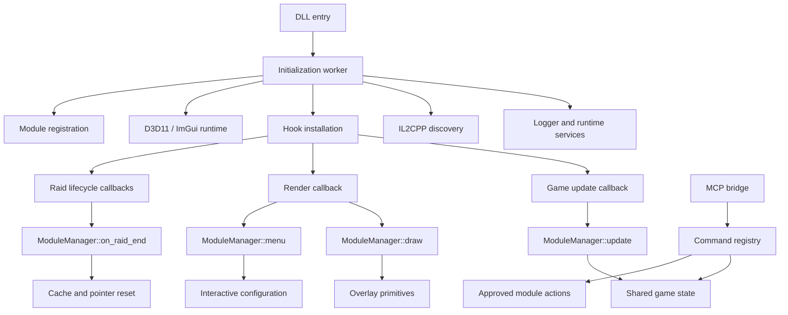

<div align="center">


# Unity/IL2CPP Runtime Research Platform

### An in-process Unity/IL2CPP research, trainer, visualization, customization, and runtime-inspection platform for **official Escape from Tarkov PvE**

[](#project-status)
[](#scope)
[](#requirements)
[](#technology)


</div>

> [!WARNING]
> This repository is experimental and version-sensitive. Game updates can invalidate method bindings, field layouts, assets, runtime assumptions, and local-raid behavior without warning.

---

## Contents

- [Overview](#overview)
- [Project status](#project-status)
- [Scope](#scope)
- [Architecture](#architecture)
- [Startup and runtime lifecycle](#startup-and-runtime-lifecycle)
- [Module system](#module-system)
- [Feature reference](#feature-reference)
- [Local map runtime](#local-map-runtime)
- [Labs status](#labs-status)
- [Icebreaker status](#icebreaker-status)
- [Configuration](#configuration)
- [MCP bridge](#mcp-bridge)
- [Rendering and interface](#rendering-and-interface)
- [IL2CPP interoperability](#il2cpp-interoperability)
- [Hooking strategy](#hooking-strategy)
- [Threading model](#threading-model)
- [Repository layout](#repository-layout)
- [Requirements](#requirements)
- [Building](#building)
- [Diagnostics](#diagnostics)
- [Development guide](#development-guide)
- [Validation checklist](#validation-checklist)
- [Known limitations](#known-limitations)
- [Roadmap](#roadmap)
- [FAQ](#faq)

---

## Overview

This project provides an in-process shared runtime for inspecting and extending Unity IL2CPP behavior inside Escape from Tarkov's official PvE environment.

Rather than implementing every feature as an isolated patch, the runtime centralizes the infrastructure required by the project:

- IL2CPP class, method, field, and object discovery;
- Detours-backed native hook installation;
- a lifecycle-aware module manager;
- D3D11 and ImGui rendering;
- world, raid, player, entity, item, and quest state tracking;
- runtime configuration and persistence;
- local command execution through the MCP bridge;
- companion UI and diagnostics;
- map-specific experimental systems.

The project is intentionally modular. Most feature code lives behind a common `Module` contract and receives lifecycle callbacks from a single manager. Shared state is reset when raids end so stale Unity objects and cached pointers are not carried into the next session.

The project should be understood as a research platform and trainer framework, not as one monolithic feature. Some modules are mature enough for regular use; others are active experiments that expose partially understood game behavior.

---

## Project status

**Status date: July 20, 2026**

| Area | Status | Notes |
|---|---:|---|
| Core injection/runtime initialization | Working | DLL entry creates the primary initialization worker and installs the shared runtime. |
| D3D11 + ImGui overlay | Working | Menu, foreground drawing, notifications, companion UI, and module rendering are operational. |
| Module lifecycle | Working | Registration, update, draw, menu, configuration, and raid-reset callbacks are centralized. |
| Official PvE support | Primary target | This is the environment the runtime is currently built around. |
| Labs forced local flow | Working | The local handoff and world initialization path is functional. |
| Labs map-specific loot | Working | Labs-specific loot generation is currently operational. |
| Labs blackout control | Implemented | Runtime lighting/blackout behavior is exposed by the map module. |
| Icebreaker scene loading | Partial | The project can reach portions of the Icebreaker experience through local experimentation. |
| Icebreaker official local start | Blocked | `/client/match/local/start` returns backend error `1000` for the true Icebreaker location. |
| Icebreaker loot | Not working | Authored Icebreaker dynamic loot is not currently reproduced correctly. |
| Icebreaker final encounter | Not implemented | Boss/final-fight behavior remains future work. |
| Configuration persistence | Working with limitations | Existing values persist; schema migration and arbitrary container editing remain limited. |
| MCP bridge | Working | Local framed protocol supports discovery, state inspection, and approved commands. |

### Status terminology

- **Working** means the path is implemented and has been observed operating in the current project state.
- **Partial** means the feature is usable only in a constrained path or is missing important authored behavior.
- **Blocked** means an external game/backend condition prevents the intended route.
- **Experimental** means the implementation is expected to change and may depend on fragile runtime assumptions.
- **Not implemented** means no complete end-to-end feature exists yet.

---

## Scope

### What the project is

The project is:

- a C++ runtime hosted inside a Unity IL2CPP process;
- a trainer and visualization framework for official Tarkov PvE;
- an extensible collection of game-state and world-interaction modules;
- a controlled interface for local development tooling;
- a test bed for map, asset, customization, and raid-flow research.

### What the project is not

The project is not:

- a replacement backend;
- a promise of compatibility with every game build;
- a polished consumer product with stable APIs;
- a guarantee that experimental map content will match authored online behavior.

---

## Architecture



### Major layers

1. **Bootstrap layer** — starts the runtime and establishes global services.
2. **Interop layer** — resolves IL2CPP types, methods, fields, strings, arrays, lists, and objects.
3. **Hook layer** — installs and owns native detours for game and rendering callbacks.
4. **State layer** — tracks raid, world, local-player, entity, quest, and item state.
5. **Module layer** — implements independent features through a shared lifecycle contract.
6. **Presentation layer** — renders the overlay, menu, notifications, and companion elements.
7. **Bridge layer** — exposes a bounded local protocol for development tooling.

---

## Startup and runtime lifecycle

A typical startup sequence is:

1. Windows loads the runtime DLL into the target process.
2. `DllMain` performs minimal loader-safe work and starts the initialization thread.
3. Logging and global runtime state are initialized.
4. Required IL2CPP classes, methods, and field offsets are resolved.
5. Shared hooks are installed.
6. Rendering support is attached to the active D3D11 swap chain.
7. Modules are registered in a deterministic order.
8. Configuration is loaded and offered to registered modules.
9. The update hook begins dispatching per-frame or per-tick module work.
10. The render hook dispatches world drawing, menu rendering, and UI work.
11. Raid transitions update shared state and trigger cleanup when the active raid ends.

### Raid cleanup

Unity objects frequently become invalid after scene changes or raid termination. Modules that cache any of the following must clear them in `on_raid_end`:

- `GameWorld` references;
- local-player pointers;
- entity lists;
- item references;
- camera references;
- cached transforms;
- scene-specific components;
- map runtime objects.

Failing to reset these references can produce stale reads, invalid calls, or state leaking between raids.

---

## Module system

Runtime modules inherit from the common module interface and are coordinated by `ModuleManager`.

A module may implement callbacks for:

- initialization;
- periodic update;
- world or foreground drawing;
- menu construction;
- configuration serialization;
- configuration deserialization;
- raid-end cleanup;
- shutdown or resource release.

### Categories

Modules are grouped into logical categories so the menu and runtime remain navigable. Current areas include:

- player;
- entities;
- items;
- quests;
- maps;
- world and environment;
- customization;
- interface and utility;
- experimental systems.

### Registration order

Registration order can matter when one module consumes state produced by another. Infrastructure and state providers should be registered before dependent presentation or action modules.

A good dependency direction is:

```text
interop and hooks
    -> shared state
        -> feature modules
            -> UI and bridge exposure
```

Avoid hidden circular dependencies between modules. Shared cross-cutting data belongs in a dedicated service or state object rather than being pulled from another module's internal implementation.

---

## Feature reference

### Player systems

Player-oriented modules provide runtime inspection and controlled modifications related to the local character. Depending on the current build, this includes player-state tracking, movement-related experimentation, camera/view behavior, and selected local properties.

The player state layer is also consumed by other modules that need:

- local-player identity;
- position and transform information;
- active raid status;
- camera association;
- inventory or equipment context.

### Entity systems

Entity tracking discovers and classifies active world objects such as players, AI, and other relevant runtime entities. The visualization path converts world positions to screen coordinates and emits overlay primitives through the shared renderer.

Entity code should distinguish between:

- object discovery;
- state caching;
- filtering;
- projection;
- drawing.

Keeping those stages separate prevents expensive Unity traversal from occurring repeatedly during rendering.

### Item systems

Item modules inspect runtime item data and support item-oriented visualization or experimentation. Item handling is complicated by nested templates, generated instances, localization, containers, world loot, inventory ownership, and map-authored spawn rules.

Labs-specific loot currently works through the implemented local map path. That success does **not** imply that Icebreaker's dynamic loot rules have been reproduced.

### Quest systems

Quest tooling exposes runtime quest state and selected development-oriented controls. Quest structures are version-sensitive and may involve both profile-backed state and active raid components.

### Weather and environment

The weather module controls or inspects selected environmental values. Map and scene behavior can override or rebuild environment components, so weather changes may need to be reapplied after transitions.

### Hideout systems

Hideout-oriented functionality interacts with available hideout runtime objects and systems. These features should not be assumed to exist during raids, and raid-only modules should not assume hideout world state.

### Outfit and customization systems

Customization support discovers available clothing and equipment customization entries, maps them to the relevant player appearance structures, and presents them through the project's interface.

Asset and customization discovery are separate concerns:

- asset discovery finds available runtime or bundled resources;
- customization discovery identifies entries valid for a player customization slot;
- application changes the active local representation;
- persistence determines whether the result survives a reload or profile refresh.

### World visualizer

The world visualizer renders selected world geometry or runtime spatial information for inspection. Large geometry sets must be bounded and cached carefully; attempting to process every available triangle or object continuously can overwhelm both the update and render paths.

---

## Local map runtime

The local map runtime is one of the project's most experimental areas. Its purpose is to understand and extend official PvE local raid behavior without pretending the client can freely launch every authored location through the same backend route.

A map being visible or loadable does not automatically mean the following are available:

- an accepted official local-start response;
- authored loot generation;
- encounter scripting;
- boss state;
- cutscene sequencing;
- extraction state;
- backend completion handling.

These systems may be initialized at different stages and may depend on server-produced data.

### Local-flow stages

A useful model for map debugging is:

1. menu location selection;
2. raid settings construction;
3. backend local-start request;
4. accepted raid response;
5. scene selection and loading;
6. `GameWorld` creation;
7. local player creation;
8. AI and encounter initialization;
9. loot generation;
10. map scripts and cutscenes;
11. extraction and raid completion.

The runtime records each stage separately. Reaching a later-looking visual state does not prove every earlier authored stage completed normally.

---

## Labs status

Labs is the current successful local-map implementation.

### Working

- forced local launch path;
- local handoff into the map;
- scene and world initialization;
- local-player initialization;
- AI/world behavior required by the current implementation;
- HUD and overlay behavior;
- Labs-specific loot generation;
- map runtime controls, including blackout behavior.

### Important clarification

**Labs loot works.** Earlier documentation that grouped Labs and Icebreaker together as having broken loot was incorrect.

Labs is therefore the reference implementation for future local-map work, but new locations cannot be assumed to use identical backend or authored-content paths.

---

## Icebreaker status

Icebreaker remains incomplete.

### Confirmed behavior

The true Icebreaker official local-start request reaches:

```text
POST /client/match/local/start
```

The backend rejects that request with generic error:

```text
1000
```

The rejection occurs before the normal `LocalGameCreate` path. As a result, the runtime cannot obtain the same accepted local-start payload that the working Labs route receives.

### What currently works

- portions of the map/scene can be reached through experimental remapping;
- the cutscene path has been observed working;
- shipped Icebreaker asset data can be inspected;
- serialized loot-point information exists in the Icebreaker bundle;
- the project can continue researching local reconstruction paths.

### What does not work

- true-location official local start;
- authored Icebreaker loot generation;
- complete dynamic content parity;
- the final boss encounter;
- a validated extraction/completion path equivalent to an accepted official raid.

### Loot research

The Icebreaker bundle contains serialized `LootPoint` data. Current research has identified multiple loot points, but a correct implementation must preserve more than positions alone. Relevant properties include:

- enabled state;
- spawn mode;
- rarity or weighting data;
- item filters;
- loot-set identifiers;
- grouped positions;
- per-point rules;
- map-specific dependencies.

A naive implementation that truncates entries, pairs arrays by index, ignores enabled flags, or discards filters cannot reproduce authored Icebreaker loot reliably.

### Current direction

The viable path is local reconstruction from shipped assets and runtime metadata, with bounded diagnostic dumps at the remap boundary. This is distinct from obtaining a valid Icebreaker response from the rejected backend endpoint.

---

## Configuration

The project provides a shared configuration system so modules can persist user-facing values without each implementing an unrelated storage format.

Typical persistent values include:

- module enabled state;
- visual distances and filters;
- menu preferences;
- environment values;
- selected customization values;
- key bindings;
- per-feature toggles.

### Module responsibilities

Each module should:

1. define stable configuration keys;
2. provide safe defaults;
3. validate loaded values;
4. serialize only persistent state;
5. avoid serializing transient Unity pointers or raid objects.

### Limitations

The current system is most reliable when updating known values in an existing schema. More advanced migration, arbitrary nested edits, versioned schemas, and automatic cleanup of obsolete keys remain areas for improvement.

---

## MCP bridge

The project includes a local MCP-oriented bridge for controlled interaction with development tools.

The bridge uses a framed local protocol and a registered command table rather than exposing arbitrary native execution. Its intended uses include:

- checking bridge availability;
- querying runtime and raid state;
- listing approved commands;
- reading selected module state;
- triggering bounded development actions;
- collecting diagnostics.

### Design goals

- local-only communication;
- explicit command registration;
- strict request framing;
- size limits;
- structured responses;
- execution on an appropriate game/runtime thread where required;
- no implicit exposure of arbitrary C++ calls.

### Conceptual command flow

```text
client request
    -> frame validation
    -> command lookup
    -> argument validation
    -> queued or immediate execution
    -> structured response
```

Commands that touch Unity objects must respect thread affinity. The bridge should queue such work to a known safe update context rather than calling Unity APIs directly from the pipe or transport worker.

---

## Rendering and interface

The runtime uses D3D11 and ImGui for its overlay and menu.

The rendering layer supports:

- menu pages and navigation;
- foreground world-space primitives;
- text and status indicators;
- notifications;
- map and entity visuals;
- companion/Clawd presentation;
- menu transitions and accent styling;
- optional blur behavior tied to the overlay window.

### Render separation

Update-heavy work should not occur in the draw callback. Modules should cache compact render-ready snapshots containing only what the renderer needs, such as:

- projected or projectable positions;
- labels;
- distance;
- health/status values;
- selected flags;
- stable display identifiers.

### Window handling

Window effects must target the project's actual overlay window. Passing an unrelated or hijacked window handle can make blur and other composition effects appear broken even when the effect code is correct.

---

## IL2CPP interoperability

The project interacts with a Unity IL2CPP runtime, where managed concepts are represented through generated native structures and metadata.

The interop layer is responsible for:

- resolving assemblies and classes;
- locating methods by name/signature;
- reading field offsets;
- invoking managed methods through native entry points;
- handling managed strings;
- traversing arrays and generic lists;
- working with Unity object lifetime rules;
- validating objects before reuse.

### Version sensitivity

Any of the following can change after a game update:

- class names;
- namespaces;
- method overloads;
- signatures;
- field offsets;
- generic layouts;
- native method addresses;
- scene object names;
- asset structures.

Interop failures should produce clear logs and disable the dependent feature rather than allowing a null or invalid binding to propagate.

---

## Hooking strategy

The runtime uses Microsoft Detours-based hooks for selected native update, rendering, and game lifecycle entry points.

A hook should:

1. resolve and validate the target;
2. store the original function pointer;
3. install once;
4. preserve the original calling convention and ABI;
5. execute minimal shared dispatch work;
6. call the original function at the correct stage;
7. detach cleanly when supported.

### Hook ownership

Shared hooks should generally be installed by infrastructure code, not independently by every feature module. The shared hook can then fan out through `ModuleManager`. This reduces duplicated detours, ordering conflicts, and teardown ambiguity.

---

## Threading model

The runtime uses several execution contexts with different responsibilities.

| Context | Responsibility |
|---|---|
| Loader entry | Minimal DLL attach handling only. |
| Initialization worker | Logging, discovery, hook installation, module setup. |
| Game/update thread | Unity-sensitive state reads, module updates, queued bridge actions. |
| Render thread | ImGui frame construction and overlay drawing. |
| MCP worker | Transport I/O, framing, parsing, and request dispatch. |
| Optional module workers | Bounded background processing that does not directly call unsafe Unity APIs. |

### Snapshot pattern

For expensive state collection, prefer:

1. collect on the appropriate update context;
2. build a compact immutable snapshot;
3. atomically publish or swap it;
4. consume it from rendering without mutating the source.

Do not hold broad locks across Unity calls or render operations.

---

## Repository layout

```text
<runtime-project>/
├─ assets/                  Runtime images, GIFs, fonts, and other UI assets
├─ module/                  Feature modules and ModuleManager
│  ├─ entity/              Entity discovery and visualization
│  ├─ item/                Item and loot functionality
│  ├─ map/                 Local-map experiments and map controls
│  ├─ player/              Local-player features
│  ├─ quest/               Quest inspection and controls
│  └─ ...                  Additional feature areas
├─ mcp/                     Local bridge, protocol, and command registry
├─ sdk/                     IL2CPP and game-facing runtime structures/helpers
├─ ui/                      Menu and interface systems
├─ util/                    Logging, configuration, and shared helpers
├─ dllmain.cpp              DLL entry and bootstrap path
├─ <runtime-project>.vcxproj Visual Studio project
└─ README.md                This document
```

The exact tree changes as modules are reorganized. Source code remains the authority when this overview and the repository diverge.

---

## Technology

- C++ on Windows;
- Visual Studio toolchain;
- Unity IL2CPP runtime interop;
- Direct3D 11;
- ImGui;
- Microsoft Detours;
- Win32 threading, windows, and local IPC primitives;
- JSON-backed configuration;
- Mermaid diagrams in documentation.

---

## Requirements

A typical development environment requires:

- 64-bit Windows;
- Visual Studio 2022 or a compatible MSVC toolchain;
- the Windows SDK selected by the project;
- C++ desktop development components;
- repository dependencies available at the paths expected by the solution;
- a game build compatible with the current bindings;
- Release x64 configuration for normal testing.

Because the runtime is injected and version-specific, a successful compile does not prove runtime compatibility.

---

## Building

1. Clone the repository.
2. Open the solution in Visual Studio.
3. Select the runtime project.
4. Choose the **Release** and **x64** configuration unless actively debugging another target.
5. Verify include and library paths for ImGui, Detours, and other project dependencies.
6. Build the project.
7. Confirm the produced DLL appears in the configured output directory.

### Output-directory warning

Inspect the `.vcxproj` and solution configuration when the expected DLL is not in `<runtime-project>/x64/Release`. The project may use a custom `OutDir`, especially in the monolithic or shared build layout.

### Common build problems

#### Missing precompiled-header file

Confirm whether the translation unit expects `stdafx.h`/`pch.h`, and make the source and project precompiled-header setting agree.

#### Unresolved Detours symbols

Verify the correct architecture library is linked and that library search paths match x64.

#### Missing ImGui symbols

Ensure required backend and core implementation files are part of the project, not only the headers.

#### Runtime starts but a module is absent

Check that the module is constructed and registered with `ModuleManager` in the active initialization path.

---

## Diagnostics

The runtime logger is the first place to inspect failures.

Useful diagnostic events include:

- startup phase completion;
- class/method resolution failures;
- hook target addresses;
- hook attach results;
- module registration;
- raid-state transitions;
- `GameWorld` acquisition/loss;
- local-player acquisition;
- map request stages;
- backend error responses;
- scene transitions;
- loot-point discovery counts;
- MCP request rejection and execution results.

### Logging guidance

Prefer messages that identify:

- the subsystem;
- the failed operation;
- the target class/method/object;
- whether the feature was disabled;
- the next expected runtime stage.

Avoid unrestricted per-frame logs. Rate-limit repeated failures and log state transitions instead of unchanged state.

---

## Development guide

### Adding a module

1. Create a class deriving from the shared `Module` interface.
2. Assign the correct category and display metadata.
3. Implement only the lifecycle callbacks the feature needs.
4. Register the module in the central initialization path.
5. Resolve dependencies during initialization or lazily with explicit failure handling.
6. Add configuration keys and defaults.
7. Clear raid-scoped state in `on_raid_end`.
8. Add structured logs for initialization and failure states.
9. Test outside a raid, during raid entry, in an active raid, and after raid exit.

### Adding an IL2CPP binding

1. Identify the assembly, namespace, class, method, and signature.
2. Resolve it through the shared interop helpers.
3. Validate the result.
4. Wrap the invocation or field access behind a narrow helper.
5. Log resolution failure once.
6. Disable dependent behavior safely when unavailable.

### Adding an MCP command

1. Define a unique command name.
2. Specify expected arguments and limits.
3. Validate all input before touching runtime state.
4. Queue Unity-sensitive work to the update thread.
5. Return a structured success or error response.
6. Keep commands bounded; do not expose arbitrary function invocation.

### Adding map-specific behavior

Document which stage the feature depends on:

- selected location;
- accepted backend response;
- scene load;
- `GameWorld` creation;
- loot initialization;
- encounter initialization;
- extraction completion.

This prevents a visual scene remap from being mistaken for full map support.

---

## Validation checklist

Before calling a feature complete, verify:

- [ ] Release x64 builds without new warnings or unresolved symbols.
- [ ] The runtime initializes and reaches the menu.
- [ ] The feature handles missing bindings gracefully.
- [ ] The feature remains disabled outside its valid context.
- [ ] Entering a raid initializes the required state.
- [ ] Leaving a raid clears cached Unity objects.
- [ ] A second raid works without restarting the process.
- [ ] Configuration values persist and invalid values are rejected.
- [ ] Render work does not perform uncontrolled object traversal.
- [ ] Logging is useful without flooding every frame.
- [ ] MCP access, when present, validates input and thread affinity.
- [ ] Documentation distinguishes observed behavior from planned behavior.
- [ ] Labs and Icebreaker statuses are reported separately.

---

## Known limitations

- Game updates can break IL2CPP bindings and native hook targets.
- Some modules depend on scene-specific object names or components.
- Configuration migration is limited.
- Unity object lifetime remains a major source of invalid cached state.
- Experimental world visualization can become expensive with unbounded geometry.
- Official PvE backend behavior limits which local map routes can be reproduced.
- Icebreaker true-location local start is rejected with error `1000`.
- Icebreaker authored loot is not working.
- Icebreaker's final encounter is not implemented.
- A loaded scene is not proof of full raid parity.
---

## Roadmap

### Core runtime

- strengthen binding validation and compatibility reporting;
- improve hook ownership and teardown;
- formalize immutable render snapshots;
- add safer module dependency declaration;
- improve configuration schema versioning and migration.

### Interface

- continue the interface visual redesign;
- expand reusable controls and navigation;
- improve diagnostic presentation;
- refine companion animation and status integration.

### MCP

- expand structured state inspection;
- improve command capability discovery;
- add stronger execution-context reporting;
- keep the bridge local, explicit, and bounded.

### Maps

- preserve Labs as the working reference path;
- document Labs regressions independently from Icebreaker;
- dump complete Icebreaker loot-point rules at the remap boundary;
- preserve enabled state, filters, loot sets, groups, and positions;
- reconstruct map-specific dynamic content from shipped assets where feasible;
- investigate encounter and final-boss initialization;
- validate extraction and cleanup behavior before describing full support.

---

## FAQ


### Does Labs loot work?

Yes. Labs map-specific loot works in the current forced-local implementation.

### Does Icebreaker loot work?

No. Icebreaker loot is still incomplete. The current implementation does not reproduce the authored loot rules correctly.

### Why not use the same path as Labs for Icebreaker?

The official backend rejects the true Icebreaker local-start request with error `1000` before the normal local game creation stage. Labs and Icebreaker therefore do not currently have equivalent usable startup paths.

### Does loading Icebreaker mean the map is fully supported?

No. Scene access, cutscene behavior, loot generation, encounter scripting, extraction, and backend completion are separate systems.

### Where should new features live?

Feature behavior belongs in a module. Shared IL2CPP, rendering, configuration, logging, and bridge behavior belongs in the corresponding infrastructure layer.

### Why did a feature stop working after an update?

The most likely causes are changed IL2CPP metadata, field layouts, native addresses, asset formats, or scene behavior. Check initialization logs and binding failures first.

---

## Responsible use

This is an experimental private research and development project. Anyone working with the code is responsible for understanding the rules, agreements, and risks that apply to the software and environment in which they use it.

Keep development controlled, avoid overstating compatibility, and clearly distinguish research observations from finished functionality.

---

## Acknowledgements

This project builds on the work of the C++, Windows, ImGui, Detours, Unity, and reverse-engineering communities. Clawd serves as the project's companion and visual mascot.

<div align="center">


*Official PvE. Labs loot working. Icebreaker still in progress.*

</div>
